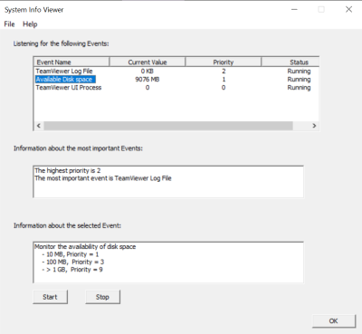

# SystemInfoViewer
C++ system event monitoring application with GUI (WTL) which continuously monitors some data sources and presents them to the user.
 
* [The size of the TeamViewer log file](#logfile)
* [The available disk space has changed](#diskspace)
* [The TeamViewer UI process (terminated or started)](#TVUI)

1. Build CMake by Visual Studio generator

or use `cmake -G "Visual Studio 16 2019" -S source -B build`

2. Open the Visual Studio solution that has been generated (SysMonitor.sln)

3. Compile 

4. To run the program, set SysMonitor as Startup Project. Click Debug

Note : Add dependency folder as include directory when missing header files